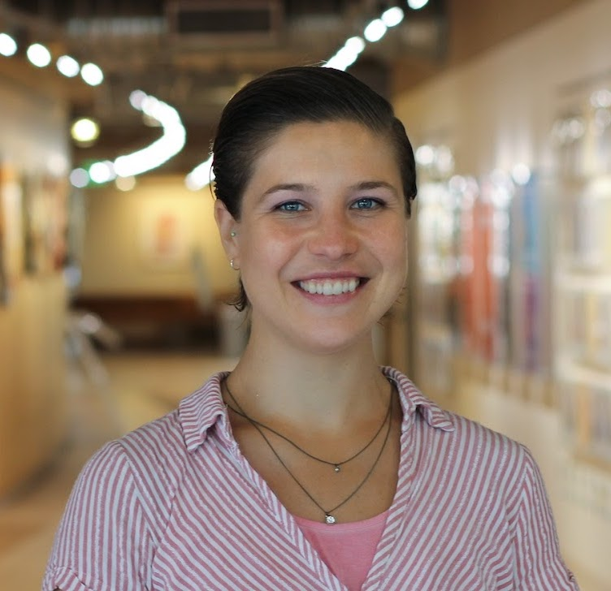

# Organizers

[**Yuanxi Fu**](https://yuanxifu.site/) is a PhD student in the **School of Information Sciences at the University of Illinois at Urbana-Champaign**. She received her MS in bioinformatics (2021) and PhD in chemistry (2015) from the University of Illinois at Urbana-Champaign and BS in chemistry from Nanjing University in China (2008). Her area of research is argumentation in science with an emphasis on theoretical and conceptual innovations. 

 
 

 

[**Dr. Sarah Bratt, PhD**](https://www.sarahbratt.com/) is an Assistant Professor at the **University of Arizona School of Information (iSchool)**. She holds a B.S. in Philosophy from Ithaca College and M.S. in Library and Information Science with a Data Science certificate from Syracuse University. Her research lies at the intersection of scholarly communication, research data management, and science of science. The overarching goal of her research is to understand and design for long-term research data sustainability and actionable science policy. Her research has been published in Quantitative Science Studies (QSS), Journal of Informetrics, and Scientometrics. She was a Research Fellow at the Laboratory of Innovation Science at Harvard (LISH), a Teaching Fellow at the iSchool Inclusion Institute (i3), and has received several awards including the PhD prize in Information Science & Technology from Syracuse University and honorable mention as a 2022 Better Scientific Software (BSSw) Fellow.   

 
 

[**Harlin Lee**](https://harlinlee.github.io) is an Assistant Professor at the **School of Data Science and Society (SDSS) at University of North Carolina, Chapel Hill** with secondary appointments in the departments of mathematics and computer science. Previously, she was a postdoc at UCLA Applied Math, and received her PhD in Electrical and Computer Engineering and MS in Machine Learning from Carnegie Mellon University in 2021. She got her BS and MEng in Electrical Engineering and Computer Science from MIT in 2016 and 2017, respectively.

Her research focuses on learning from high-dimensional data supported on structures such as graphs, networks or low-dimensional subspaces, motivated by applications in health care and social science. She has been recognized with Rising Stars in Data Science (2022), Rising Stars in Computational and Data Sciences (2022) and Carnegie Mellon University Electrical and Computer Engineering Outstanding Woman in Engineering (2021).

# Program Committee

[Eamon Duede](https://eamonduede.com/) (Harvard University)

[James Evans](https://macss.uchicago.edu/directory/James-Evans) (University of Chicago)

[Jacob G. Foster](https://soc.ucla.edu/person/jacob-foster/) (UCLA)

[Erin Leahey](https://sociology.arizona.edu/people/erin-leahey) (University of Arizona)

[Jodi Schneider](https://ischool.illinois.edu/people/jodi-schneider) (University of Illinois Urbana-Champaign)

[Jevin West](https://jevinwest.org/) (University of Washington)

