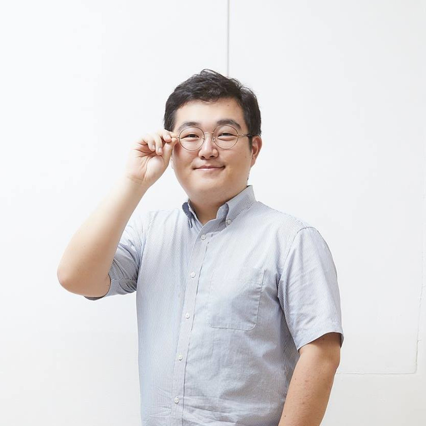

# Speakers
[Eun Lee](https://scholar-google-com.proxy2.library.illinois.edu/citations?user=kXggWVUAAAAJ&hl=en), Pukyong National University
[Vincent Traag](https://www.traag.net), Leiden University  
[Bart Thijs](https://www.kuleuven.be/wieiswie/en/person/00040232), KU Leuven  
[Lucila Gisele Alvarez Zuzek](https://scholar.google.com.ar/citations?user=CgrQ6asAAAAJ&hl=es), Bruno Kessler Foundation

<!--

  

  **Opening Remarks**
  
[**Dr. Vincent Larivière**](https://unesco.ebsi.umontreal.ca/en/vincent-lariviere/) is a full professor of information science at the École de bibliothéconomie et des sciences de l'information, Université de Montréal, where he teaches research methods and bibliometrics. He is also the scientific director of the Érudit journal platform, associate scientific director of the Observatoire des sciences et des technologies, vice-rector of strategic planning and communications and a regular member of the Centre interuniversitaire de recherche sur la science et la technologie. He holds a B.A. in Science, Technology and Society (UQAM), an M.A. in history of science (UQAM) and a Ph.D. in information science (McGill), and has performed postdoctoral work at Indiana University’s Department of Information and Library Science.

 
 

  

  **Title**: How COVID-19 impacted academia?
  
[**Dr. Jinhyuk Yun**](https://bluekura.github.io/) is an assistant professor at Soongsil University's School of AI Convergence. Before joining Soongsil University, he worked as a Senior Research Scientist at the Korea Institute of Science and Technology Information from 2016 to 2020 and as a Data Scientist at Naver Corporation in 2016. He received his Ph.D. in Physics from the Korea Advanced Institute of Science and Technology, where he holds a B.S. in Physics. He is fascinated by the structure and dynamics of human knowledge formation and identifies hidden patterns of human knowledge beneath the surface.

 
 

  

  **Title**: How does team gender composition affect scientific disruption? 
  
[**Dr. Diego Gómez-Zará**](https://www.dgomezara.cl/) is an assistant professor in Computer Science at the University of Notre Dame. He received his Ph.D. in Technology and Social Behavior from Northwestern University. His research focuses on how social computational systems help people organize and collaborate. His work has been at the forefront of computational social science, human-computer interaction, and social network analysis.

 
 

  **Title**: The Emergence of the Economics of Science: Evidence from the WOEPS workshop (2007-2023)
  
[**Dr. Daniel Souza**](https://www.som.polimi.it/professor/de-souza-daniel-fernando/) is an Assistant Professor at the Polytechnic University of Milan. He holds a PhD in Economics from the University of Turin, where he previously worked as a postdoctoral researcher. His research lies broadly at the intersection of economics, science & technology studies, and science of science. His research agenda encompasses various themes such as university-industry collaboration, open science and the dynamics of scientific collaborations. Currently, he is exploring the role of universities within entrepreneurial ecosystems and the emergence of artificial intelligence as a possible general-purpose technology.

 
 

-->
