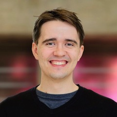

# Speakers

[Dr. Rodrigo Dorantes-Gilardi](https://rodogi.github.io) is a Associate Research Scientist and part-time Lecturer at **Northeastern University**. His research at NetSI centers on Network Science with applications in biology and the science of science. He currently work in the team of Albert-László Barabási, where they study the impact of biotechnology in science and innovation. Using computational methods, his work involves studying the factors that influence impact & recognition in creative fields.

[Dakota Murray](https://dakotamurray.me) is an assistant professor in the department of Information Science and Technology at the University at Albany. He earned a doctorate in Informatics from Indiana University – Bloomington. Since then, he has worked as a professional data scientist at Digital Science where he provided bibliometric consultation for national funding agencies, and then later as a research faculty at the Network Science Institute at Northeastern University. Dr. Murray's research aims to understand the social forces and networks of communication underpinning knowledge production. His work blends data-driven and computational approach with theory from sociology, philosophy and science and technology studies. Specific projects have examined disagreement in science, scientists’ mobility, interdisciplinary collaboration and open source software ecosystems.

